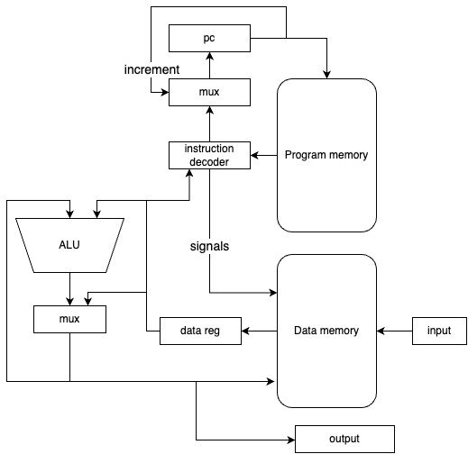

# Лабораторная работа № 3

- Пащенко Олег Дмитриевич P33141
- `lisp -> asm | cisc -> risc | harv | mc -> hw | tick -> instr | struct | stream | port | cstr | prob2`
- С упрощением

## Язык программирования

### Синтаксис

```
program ::= <section_text> <section_data> | <section_data> <section_text> | <section_text>
<section_data> ::= "section .data:" <variables>
<section_text> ::= "section .text:" <instructions>
<variables> ::= (<variable> | (<int> | <string>))
<instructions> ::= (<label> | <instruction>)
<name> ::= [a-zA-Z]+
<label> ::= "."<name> ":"
<variable> ::= <name> ":"
<reg=> ::= "r1" | "r2" | "r3" | "r4" | "r5" | "r6" | "r7" | "r8 | "r9" | "r10" | "r11" | "r12" | "r14" | "r15""
<string> ::= '"' <character>, { <character> | <underscore> | " " } '"'
<char> ::= "'" ( <character> | "\0" | "\n" ) "'"
<int> ::= <digit>, { <digit> }
<digit> ::= "0" | "1" | "2" | "3" | "4" | "5" | "6" | "7" | "8" | "9"
bin_ops ::= ("CMP" | "LD" | "ST" | "MOV" | "ADD" | "CMP" | "DIV") " " ((<reg> ", " <reg>) | (<reg> ", " "(" <name> ")") | ("(" <name> ")" ", " <reg>))
un_ops ::= ("INC" | "DEC" | "NEGR") " "  (<reg>)
branch ::= ("JMP" | "JE" | "JG") " " (<label>)
zero_arg ::= ("HLT" | "NOP")
<instruction> ::= <bin_ops> | <un_ops> | branch | <zero_arg>
```

### Описание

- Поддержка строковых и числовых литералов
- Переменные объявляются в секции `.data`, инструкции в секции `.text`
- Точка входа объявляется меткой `.start`

### Набор инструкции

| Инструкция    | Такты |
|---------------|-------|
| MOV reg, reg  | 4     |
| LD reg, [reg] | 5     |
| ST [reg], reg | 5     |
| INC reg       | 3     |
| DEC reg       | 3     |
| NEGR reg      | 3     |
| ADD reg, reg  | 3     |
| SUB reg, reg  | 3     |
| DIV reg, reg  | 3     |
| MOD reg, reg  | 3     |
| CMP reg, reg  | 3     |
| TEST reg, reg | 3     |
| JUMP label    | 2     |
| JG label      | 2     |
| JE label      | 2     |
| IN reg, port  | 4     |
| OUT port, reg | 4     |

### Пример программы выводящий `Hello world!`

```
section .data
    hello_str: "hello, world!"
section .text
.start:
    MOV r2, 0
    MOV r1, hello_str
.reload:
    LD r3, [r1]
    CMP r2, r3
    JE .exit
    OUT 1, r3
    INC r1
    JMP .reload
.exit:
    HLT
```

Компилируется в `JSON` следующего формата:

```json
{
  "data_mem": {
    "0": 104,
    "1": 101,
    "2": 108,
    "3": 108,
    "4": 111,
    "5": 32,
    "6": 119,
    "7": 111,
    "8": 114,
    "9": 108,
    "10": 100,
    "11": 33,
    "12": 0
  },
  "start": 0,
  "code_mem": {
    "0": {
      "opcode": "mov",
      "args": [
        "r2",
        "0"
      ]
    },
    "1": {
      "opcode": "mov",
      "args": [
        "r1",
        "0"
      ]
    },
    "2": {
      "opcode": "ld",
      "args": [
        "r3",
        "r1"
      ]
    },
    "3": {
      "opcode": "cmp",
      "args": [
        "r2",
        "r3"
      ]
    },
    "4": {
      "opcode": "je",
      "args": [
        "8"
      ]
    },
    "5": {
      "opcode": "out",
      "args": [
        "1",
        "r3"
      ]
    },
    "6": {
      "opcode": "inc",
      "args": [
        "r1"
      ]
    },
    "7": {
      "opcode": "jmp",
      "args": [
        "2"
      ]
    },
    "8": {
      "opcode": "hlt",
      "args": []
    }
  }
}
```

- data_mem - память данных
- code_mem - память инструкций
- start - точка входа в памяти инструкций

## Организация памяти:

Гарвардская архитектура, память данных и память команд разделена.
Данные и инструкции располагаются в начале соответствующих себе адресных пространств.
При инициализации процессора `r15` устанавливается на последний адрес памяти данных.

### Память данных

Массив 32-х битных слов, реализуется используя `list[int]`.
При старте симуляции инициализируется нулевыми значениями.

- Строковые литералы выделяются статически при компиляции в c-style.

### Память команд

Реализуется с использованием `list[Instruction]`.
При старте симуляции инициализируется `NOP` инструкциями.

### Регистры

`r1 r2 r3 r4 r5 r6 r7 r8 r9 r10 r11 r12  r14 r15` - общего назначения. При инициализации `r15` устанавливается в конец
памяти данных, что позволяет программисту работать с ним как со стеком используя `INC` и `DEC`.

## Транслятор

Программа запускается с помощью команды `./translator.py hello_user.vasm hello_user.json` и ее реализация содержится в файле `translator.py`.

Она начинает работу с прохода по секции `.data`, в процессе которого преобразует ее содержимое в словарь, где каждой переменной сопоставляется адрес в памяти данных.

Затем происходит первый проход по секции `.text`, в результате которого формируется словарь, где каждой метке сопоставляется адрес в памяти команд.

Далее следует второй проход по секции `.text`, в ходе которого происходит разрешение всех переменных и меток, используя словари, полученные на предыдущих этапах.
## Модель процессора

- Формат запуска: ` ./machine.py hello_user.json ./my_name`. Имя файла с входными данными можно опустить если в них нет
  нужды.
  Реализована в [machine.py](machine.py)

### Схема



## Тестирование

Тестирование производится набором **golden** тестов, реализация в директории: [tests](tests).
Тестируются следующие алгоритмы:

- cat
- hello
- hello_user_name
- prob1

Исходные коды алгоритмов находятся в:
[sources](examples/sources)

## Статистика

|           ФИО           |       алг       | LoC | code байт | code инстр. | инстр. | такт. |
|:-----------------------:|:---------------:|:---:|:---------:|:-----------:|:------:|:-----:|
| Пащенко Олег Дмитриевич |       cat       | 11  |           |      7      |   50   |  148  | 
| Пащенко Олег Дмитриевич |      hello      | 15  |           |      9      |   78   |  246  | 
| Пащенко Олег Дмитриевич | hello_user_name | 42  |           |     30      |  803   | 2548  | 
| Пащенко Олег Дмитриевич |      prob2      | 49  |           |     39      | 11688  | 32620 |